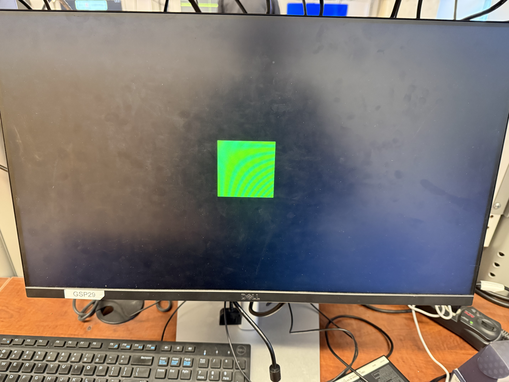
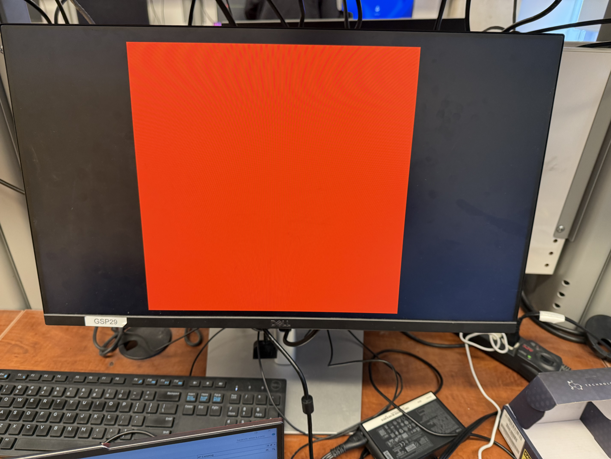

# FPGA Ultrasonic Car Parking Assist System

**Authors:** Rohit Butta & Kyle Wolfe  
**Course:** EECS 3216 – Digital Systems  
**Target Hardware:** Intel MAX 10 FPGA (DE10-Lite Board)

An end-to-end digital system implemented in Verilog that interfaces an ultrasonic distance sensor with an FPGA to deliver real-time multimodal user feedback. The system calculates target proximity, applies an 8-sample moving average FIR filter to eliminate noise, and updates a 640x480 @ 60Hz VGA visual warning display, a 4-tier audio alarm, and 7-segment distance readouts in real time.

---

## Live System Demo


---

## Hardware Setup & Circuit Wiring


The system connects the DE10-Lite board to an HC-SR04 ultrasonic distance sensor, a piezoelectric buzzer, 7-segment displays, and a 15-pin VGA monitor.

---

## System Architecture & Module Breakdown

* **`fpga_parking_assist.v`**: Top-level module interconnecting clock networks, PLL IP core, sensor driver, FIR filter, display decoder, and VGA graphics generators.
* **`ultrasonic_sensor.v`**: Generates a 10 µs trigger pulse and measures the echo pulse duration using 50 MHz clock ticks to compute distance in centimeters.
* **`moving_average.v`**: Implements an 8-sample moving average filter using an array pipeline and bit-shifting (`>> 3`) to eliminate sensor jitter and environmental noise.
* **`buzzer_alarm.v`**: Generates multi-rate audio warnings by tapping specific counter bit flips to scale frequency with distance.
* **`vga_sync.v` & `vga_drawer.v`**: Synthesizes 640x480 @ 60Hz VGA timing and dynamically draws a centered target box that expands and shifts color gradients based on proximity.
* **`display_driver.v` & `bcd_to_7seg.v`**: Converts binary distance values into Binary Coded Decimal (BCD) and drives three active-low 7-segment displays.
* **`vga_pll.v` & `vga_pll_bb.v`**: Intel ALTPLL IP core module synthesizing the required 25 MHz pixel clock from the 50 MHz onboard clock.

---

## Proximity Zones & Multimodal Visual/Audio Feedback

| Distance Range | Danger Level | Audio Alarm Rate | VGA Visual Box Indicator |
| :--- | :--- | :--- | :--- |
| $\ge 40\text{ cm}$ | Green Zone | Silent (No Beep) | Small centered box, Solid Green |
| $25\text{ cm} - 39\text{ cm}$ | Yellow Zone | Slow Beep (~0.6s pulse) | Medium box, Green-to-Yellow gradient |
| $15\text{ cm} - 24\text{ cm}$ | Orange Zone | Medium Beep (~0.15s pulse) | Expanding box, Yellow-to-Orange gradient |
| $< 15\text{ cm}$ | Red Zone | Fast Beep (~0.04s pulse) | Full-size box, Solid Red alert |

### Proximity Visual States

| Green Zone ($\ge 40\text{ cm}$) | Yellow Zone ($25 - 39\text{ cm}$) |
| :---: | :---: |
|  |  |

| Orange Zone ($15 - 24\text{ cm}$) | Red Zone ($< 15\text{ cm}$) |
| :---: | :---: |
|  |  |

---

## FPGA Pin Mapping (Intel MAX 10 / DE10-Lite)

| Signal Name | FPGA Pin | Hardware Component | Function |
| :--- | :--- | :--- | :--- |
| `CLOCK_50` | `PIN_P11` | Onboard Oscillator | 50 MHz System Clock |
| `KEY[0]` | `PIN_B8` | Pushbutton 0 | Active-Low System Reset |
| `SW[0]` | `PIN_C10` | Slide Switch 0 | Filter Toggle (`0`: Raw, `1`: Filtered) |
| `ARDUINO_IO[0]` | `PIN_AB5` | Breadboard Header | Ultrasonic Trigger Pulse Output |
| `ARDUINO_IO[1]` | `PIN_AB6` | Breadboard Header | Ultrasonic Echo Input (3.3V Shifted) |
| `ARDUINO_IO[2]` | `PIN_AB7` | Breadboard Header | Piezoelectric Buzzer Output |
| `HEX0` – `HEX2` | Multiple | 7-Segment Displays | Active-Low Numeric Distance Readout (cm) |
| `VGA_R[3:0]`, `G[3:0]`, `B[3:0]` | Multiple | VGA Port | 4-bit RGB Color Channels |
| `VGA_HS`, `VGA_VS` | Multiple | VGA Port | Horizontal & Vertical Sync Signals |

---

## Repository Directory Layout

```text
├── assets/
│   ├── demo.gif
│   ├── circuit_setup.jpeg
│   ├── green_zone.jpeg
│   ├── yellow_zone.jpeg
│   ├── orange_zone.jpeg
│   └── red_zone.jpeg
├── bcd_to_7seg.v
├── buzzer_alarm.v
├── display_driver.v
├── fpga_parking_assist.qpf
├── fpga_parking_assist.qsf
├── fpga_parking_assist.v
├── moving_average.v
├── ultrasonic_sensor.v
├── vga_drawer.v
├── vga_pll.v
├── vga_pll_bb.v
├── vga_sync.v
├── .gitignore
└── README.md
